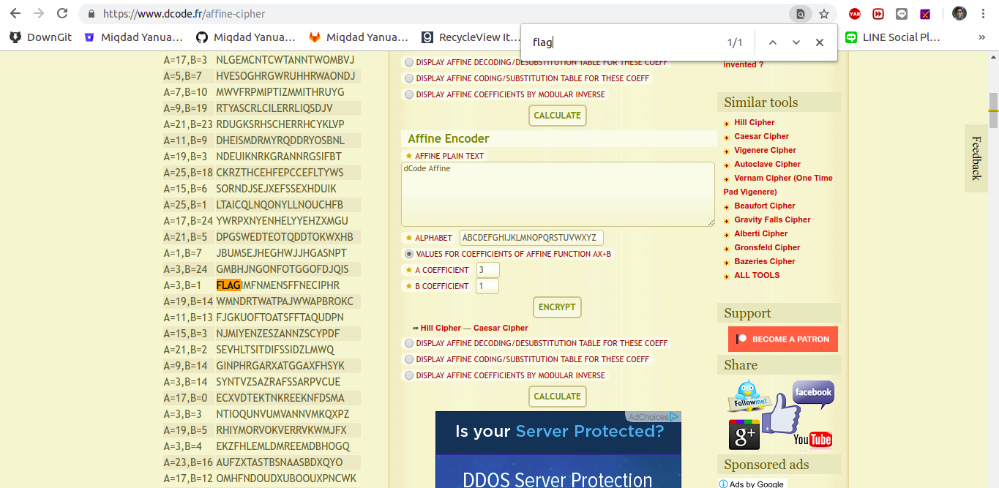
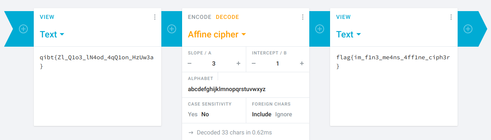

### Soal

Anak didik Ms. A sedang dalam dilema asmara, Ia sedang memberi kode kepada pasangannya dalam bentuk teks. Namun, karena dirinya seorang mahasiswa yang mengambil matakuliah Kriptografi, Ia memberi kode yang benar benar di enkripsi secara primitif. Sebagai Calon Hacker, Bantu pasangan anak didik Ms. A sehingga pesan kode bisa dibaca!

[Aku Rapopo.txt](../assets/soal/Aku_Rapopo.txt)

HINT 1 : Bahasa inggris aku rapopo?

### Langkah - langkah
1. Enkripsi Aku Rapopo artinya adalah affine jadi kita bisa decrypt otomatis pada web [Decryptor Affine](https://www.dcode.fr/affine-cipher)
2. ctrl + f cari kata flag

3. Tetapi karakter yang dihasilkan agak berantakan, oleh karena itu catat slope A dan slope B saja
4. Decode pada website lain [Cryptoo](https://cryptii.com/) dan masukan slope A=3, B=1

  

  ```
  flag{im_f1n3_me4ns_4ff1ne_ciph3r}
  ```
