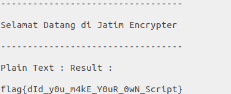

### Soal

Jawa timur terkenal dengan pahlawannya. pahlawan pahlawan tersebut menyembunyikan teks rahasia sehingga memerlukan suatu teknik rahasia untuk membukanya. Para Ilmuan berusaha untuk mengetahui pesan apa yang ingin disampaikan para pahlawan. Sebagai calon Hacker yang baik, bantu "lagi" masyarakat Indonesia ya! :)

[flag_enc.py](../assets/soal/jatim_flag_enc.py)  
[msg_enc.txt](../assets/soal/jatim_msg_enc.txt)

### Langkah - langkah
Soal ini mirip dengan seperti soal analyze yaitu print kata "Jatim" sebanyak y kali dan y adalah xor dari ascii sebuah karakter dengan 110 ditambah dengan 3.
1. Replace semua kata jatim dengan single karakter contohnya J
[msg_enc.txt (Edited)](../assets/soal/jatim_msg_enc_answer.txt)  
2. Buat Decryptnya dengan membalik operasi pada file python tersebut [jatim.py (Edited)](../assets/soal/jatim_flag_enc_answer.py)  
3. Run file pythonnya yang baru

  


  ```
  flag{dId_y0u_m4kE_Y0uR_0wN_Script}
  ```
