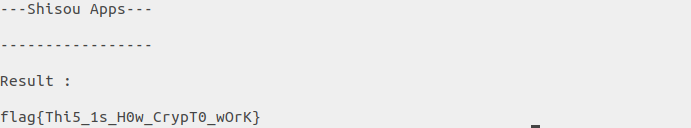

### Soal

Ms. A Sedang menguji mahasiswanya dengan memberi soal analisa program yang bisa digunakan untuk enkripsi. Yabyo bingung karena ia tidak masuk kelas pada hari itu. Bantu Yabyo untuk melakukan dekripsi soal dari Ms. A

[analyze.py](../assets/soal/analyze.py)  
[flag.txt](../assets/soal/analyze_flag.py)

HINT 1 : Analisa alur program

### Langkah - langkah
1. Jika dilihat dari filenya print "-Open Source-" merupakan hal yang tidak penting, sehingga kita dapat menghapusnya dan menghasilkan sebuah baris flag yang sudah dienkripsi
``` _eZ`tMab.X*lXA)pX<kriM)XpHkDv ```
2. Setelah itu buat script untuk membalik enkripsi flag tersebut dengan cara membalik semua operasi pada file python [analyze.py (Edited)](../assets/soal/analyze_answer.py)
3. Run file pythonnya

  


  ```
  flag{Thi5_1s_H0w_CrypT0_wOrK}
  ```
