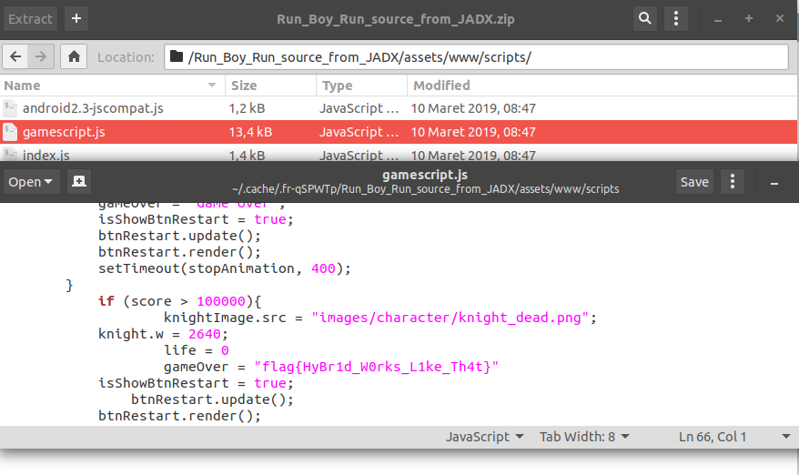

### Soal
> "BRICK!!! Coba Kau Selesaikan Game ini" -Ujar Mr. K "Oke, score minimum berapa?" - Tanya Brick "100.000 Score" - Mr. K "Hadiahnya?" - Brick "Flag" - Mr. K

[Run_Boy_Run.apk](../assets/soal/Run_Boy_Run.apk)

### Langkah - langkah
1. Decompile file apk di [APK Decompiler](www.javadecompilers.com/apk) dan Download hasilnya
2. Cari file script pada directory /assets/www/scripts/gamescripts.js
3. Flag pada fungsi game over



```
flag{HyBr1d_W0rks_L1ke_Th4t}
```
