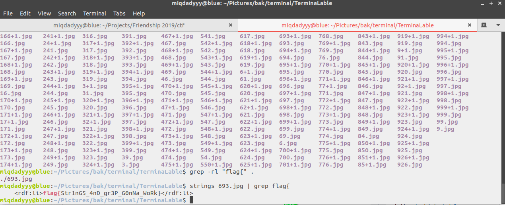

### Soal

Selalu ada yang berbeda. Tapi, apa?

https://drive.google.com/file/d/1Vk_8LiKK5VzrcDkUpCrl5rnbTAOLdz8N/view?usp=sharing

Alert! Big size file

### Langkah - langkah
1. Extract semua file
2. Gunakan command grep semua file dalam satu directory pada terminal  ``` grep -rl "flag{" <current_directory> ```
3. Lalu muncul sebuah nama file yang terdapat kata "flag{" dan kemudian kita strings saja dengan grep "flag{" lagi ``` strings 693.jpg | grep flag{ ```

  

  ```
  flag{Str1nG5_4nD_gr3P_G0nNa_WoRk}
  ```
