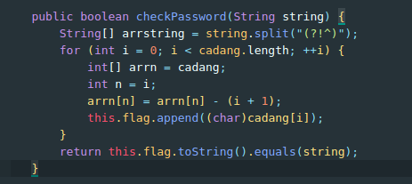

### Soal
Bang Satria sedang mengerjakan tugas Pemrograman lanjutnya. Ia iseng dan meminta file .class temannya dan berharap bisa melihat source code dari file .class tersebut. Sebagai Calon Hacker, Bantu Bang Satria untuk melihat source code file tersebut!

[Ngopi.class](../assets/soal/Ngopi.class)

Hint 1 : Lakukan Reversing .class Baca alur programnya

### Langkah - langkah
Diberi sebuah file .class yaitu hasil compile dari bahasa pemrogram java  
Intinya tinggal kembalikan ke file .java aja
1. Lakukan decompile online di [Java Decompiler](http://www.javadecompilers.com/) dengan jenis decomiler JAD
2. Lalu dapat file [Ngopi.java](../assets/soal/Ngopi.java), tapi jika kita compile ulang terjadi error karena tidak ada class bernama Node, sehingga revese aja dimana mereka print flagnya.

3. Ada sebuah kecurigaan pada fungsi checkPassword, fungsi tersebut me-generate flag lalu membandingkannya dengan inputan, sehingga kita modifikasi sedikit program tersebut untuk generate flag  
<*BEFORE*>

<*AFTER*>

4. Compile program dan run


```
flag{pAk3_t0oL5_Y4aa}
```
